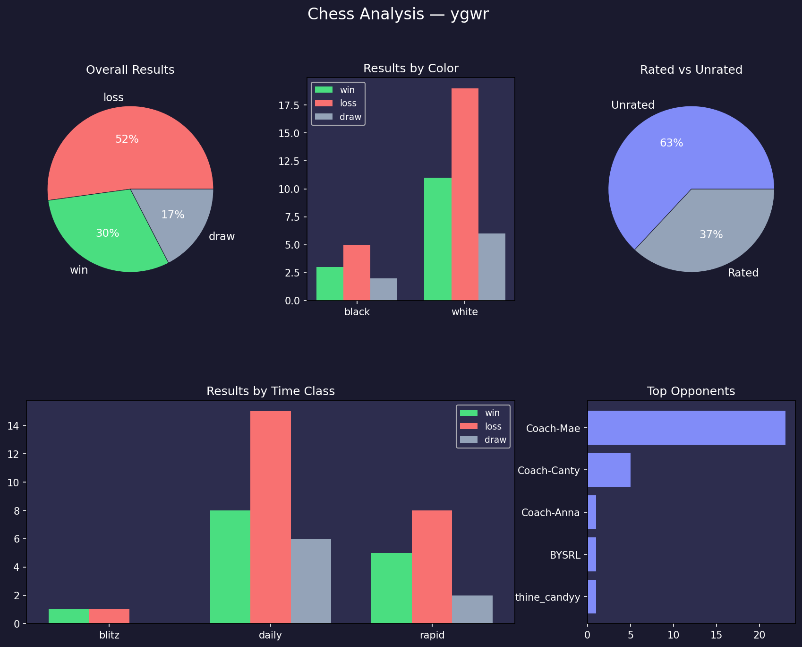
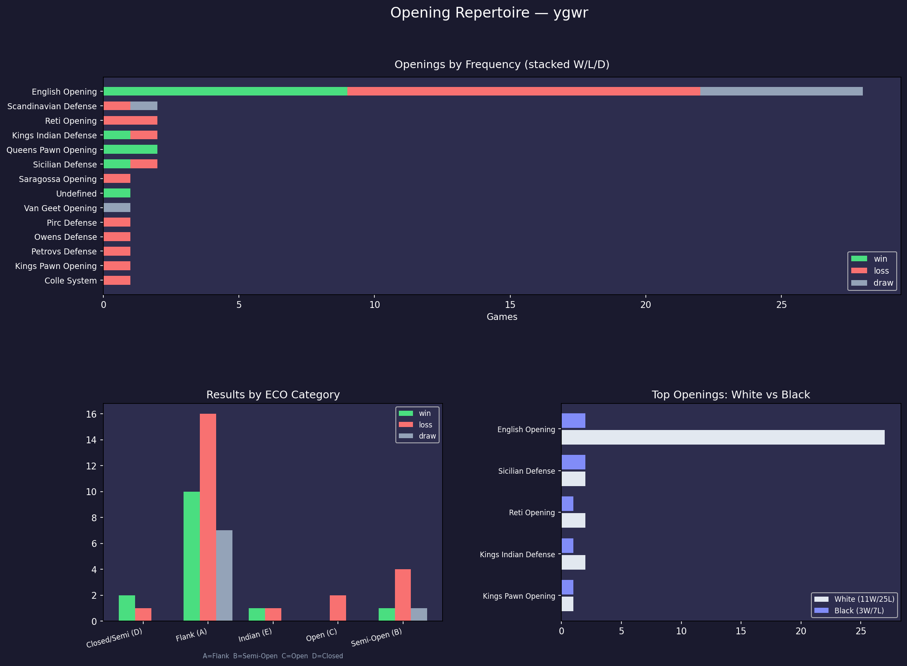
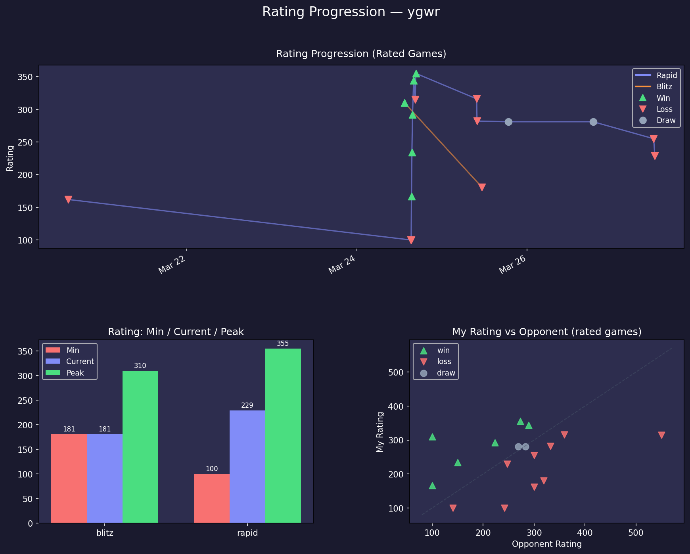
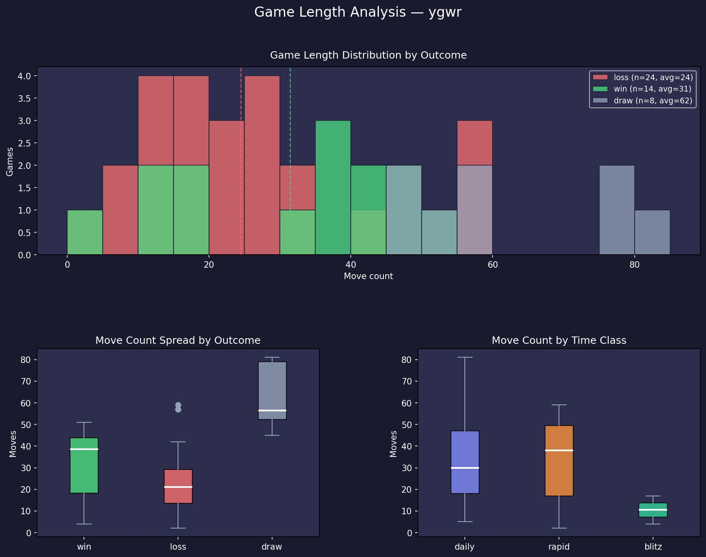

# chess-analysis

Python analysis of my chess.com games — charts, stats, and opening/rating breakdowns for player **ygwr**.

## Stack

| Layer | Tool |
|-------|------|
| Data | chess.com public API |
| Analysis | Python · pandas |
| Charts | matplotlib |

## Running

```bash
# activate venv first
.venv\Scripts\Activate.ps1

# fetch latest games
python fetch.py

# run any analysis
python analysis/overview.py
python analysis/openings.py
python analysis/rating.py
python analysis/game_length.py
```

## Charts

### Overview
Win/loss/draw by color, time class, and rated status. Top opponents by game count.



### Openings
Opening family frequency and win rate. ECO category breakdown uses rated games only to filter out coach practice noise.



### Rating Progression
Rapid and blitz rating over time, with win/loss/draw markers per game. Min/current/peak comparison.



### Game Length
Move count distribution by outcome and time class. Loss reasons (resigned vs checkmated) with average game length.



## Key Findings (Mar 2026 · 46 games)

- **30% overall win rate** — 14W 24L 8D
- **63% unrated** — mostly coach practice (Coach-Canty, Coach-Mae, Coach-Anna)
- **English Opening in 61% of games** — rated win rate there: 38%
- **Rapid rating: 162 → peak 355 → 229** (+67 net)
- **Resigned losses avg 22 moves** vs checkmates at 29 — room to fight longer
